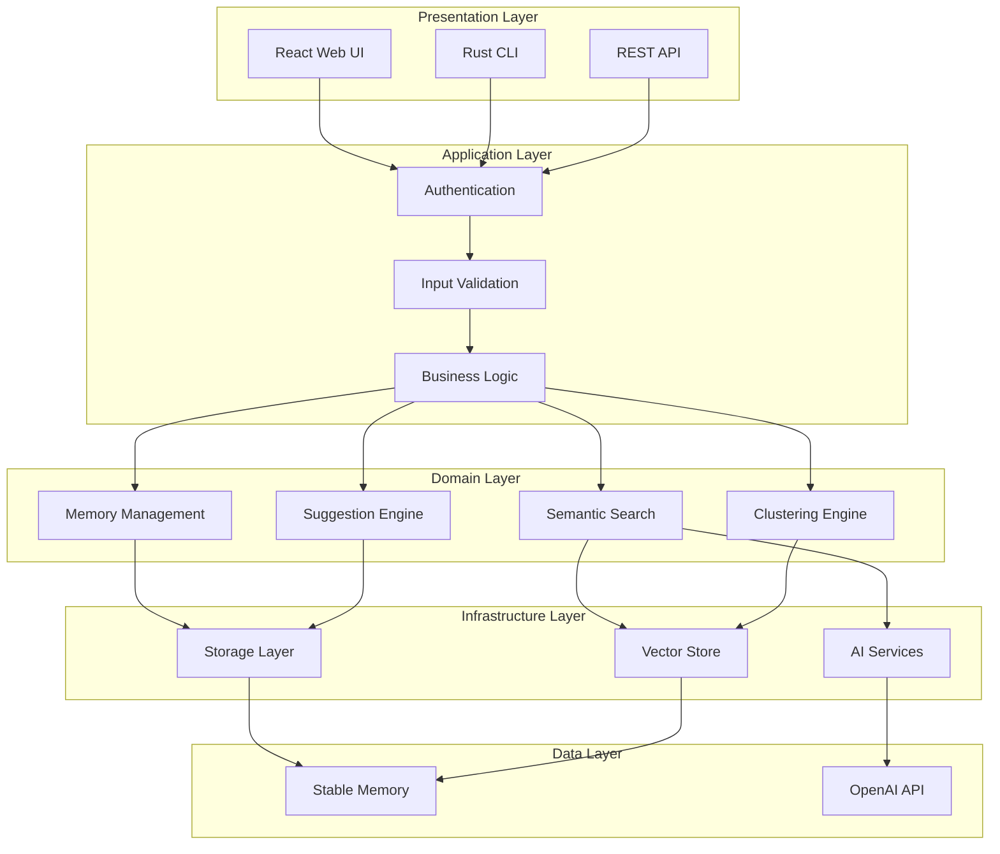
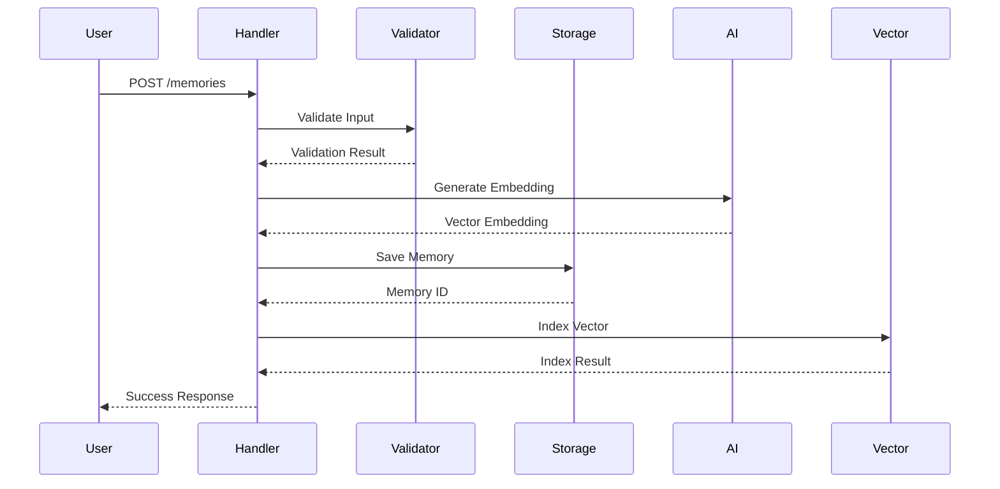
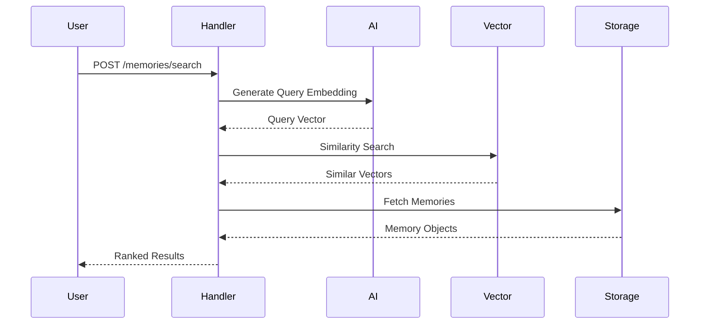
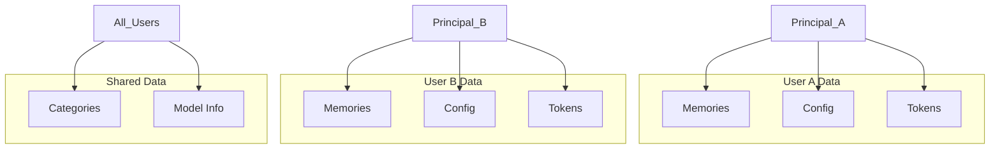
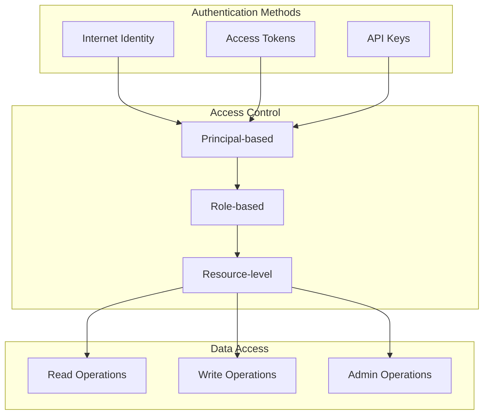
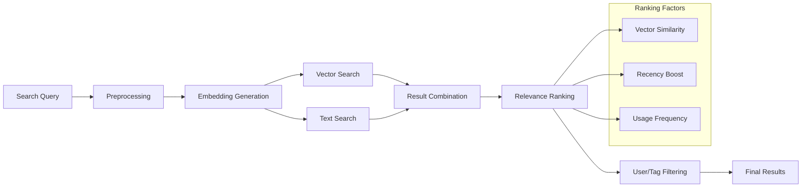

# OpenMemory アーキテクチャ詳細

## 🏗️ システム概要

OpenMemoryは、Internet Computer Protocol（ICP）上に構築されたスケーラブルなAI駆動メモリ管理システムです。分散型インフラストラクチャを活用し、セマンティック検索、自動分類、マルチプラットフォーム対応を実現しています。

## 📋 設計原則

### 1. 分散化ファースト
- **真の分散型**: 中央集権的なサーバーに依存しない
- **Internet Identity統合**: 分散型認証システム
- **Canister Smart Contracts**: 完全にオンチェーンでの実行

### 2. セキュリティ
- **Principal-based Access Control**: ICのネイティブ認証
- **データ分離**: ユーザーごとの完全なデータ隔離
- **Zero-Trust Architecture**: 全てのリクエストを検証

### 3. パフォーマンス
- **Stable Memory**: アップグレード耐性のある永続化
- **Vector Indexing**: 高速類似検索
- **並列処理**: Rustの安全な並行性

### 4. 拡張性
- **モジュラー設計**: 機能ごとの分離された設計
- **プラグイン対応**: 外部統合の容易性
- **マルチプラットフォーム**: Web、CLI、API

## 🧠 コアアーキテクチャ

### レイヤー構造



## 🔄 データフロー

### 1. メモリ保存フロー



### 2. セマンティック検索フロー



## 🗄️ データ永続化

### Stable Memory 構造

```rust
// メモリ管理: 各データ型に専用のメモリ領域
const MEMORY_ID_MEMORIES: MemoryId = MemoryId::new(0);
const MEMORY_ID_USER_MEMORIES: MemoryId = MemoryId::new(1);
const MEMORY_ID_CONVERSATIONS: MemoryId = MemoryId::new(2);
const MEMORY_ID_USER_CONVERSATIONS: MemoryId = MemoryId::new(3);
const MEMORY_ID_USER_CONFIG: MemoryId = MemoryId::new(4);
const MEMORY_ID_ACCESS_TOKENS: MemoryId = MemoryId::new(5);

type MemoryMap = StableBTreeMap<String, Memory, VMem>;
type UserMemoryMap = StableBTreeMap<Principal, UserMemoryList, VMem>;
type ConversationMap = StableBTreeMap<String, Conversation, VMem>;
type UserConversationMap = StableBTreeMap<Principal, UserConversationList, VMem>;
type UserConfigMap = StableBTreeMap<Principal, UserConfig, VMem>;
type AccessTokenMap = StableBTreeMap<String, AccessToken, VMem>;
```

### データ分離戦略



## 🤖 AI統合アーキテクチャ

### 埋め込みベクトル生成

```rust
pub async fn generate_embedding_for_user(text: &str, user_id: Principal) -> Result<Vec<f32>> {
    // 1. ユーザー設定を取得
    let user_config = get_user_config(user_id)?;
    
    // 2. APIプロバイダーに基づく処理
    match user_config.api_provider {
        ApiProvider::OpenAI => {
            call_openai_api(text, &user_config.openai_api_key?).await
        }
        ApiProvider::OpenRouter => {
            call_openrouter_api(text, &user_config.openrouter_api_key?).await
        }
    }
}
```

### ベクトル類似検索

```rust
pub fn similarity_search(
    query_vector: &[f32],
    limit: usize,
    user_filter: Option<Principal>
) -> Result<Vec<SimilarityResult>> {
    // 1. Hash-based indexing for performance
    let candidates = get_vector_candidates(query_vector)?;
    
    // 2. Compute similarities
    let mut similarities: Vec<_> = candidates
        .iter()
        .filter_map(|(id, vector, norm)| {
            if let Some(user) = user_filter {
                if !memory_belongs_to_user(id, user) {
                    return None;
                }
            }
            
            let similarity = cosine_similarity_with_norms(
                query_vector, vector, 1.0, *norm
            );
            
            Some(SimilarityResult {
                memory_id: id.clone(),
                similarity,
            })
        })
        .collect();
    
    // 3. Sort and limit results
    similarities.sort_by(|a, b| b.similarity.partial_cmp(&a.similarity).unwrap());
    similarities.truncate(limit);
    
    Ok(similarities)
}
```

## 🔐 認証・認可システム

### マルチモーダル認証



### ハイブリッドトークン認証

```rust
pub async fn authenticate_request(req: &HttpRequest) -> Result<Principal> {
    if let Some(token) = extract_bearer_token(&req.headers) {
        // アクセストークンチェック
        if token.starts_with("om_token_") {
            return verify_access_token(&token);
        }
        // レガシートークン
        return verify_token(&token).await;
    }
    
    // APIキー認証
    if let Some(api_key) = extract_api_key(&req.headers) {
        return verify_api_key(&api_key).await;
    }
    
    Err(OpenMemoryError::authentication(
        "Missing Authorization header or API Key",
        "none"
    ))
}
```

## 🔍 検索エンジンアーキテクチャ

### 多層検索システム



### 提案エンジン

```rust
pub struct SuggestionEngine {
    recent_searches: LRUCache<String, SearchQuery>,
    popular_tags: FrequencyMap<String>,
    trending_topics: TrendingAnalyzer,
}

impl SuggestionEngine {
    pub fn get_suggestions(&self, partial_query: &str, user_id: Principal) -> Vec<Suggestion> {
        let mut suggestions = Vec::new();
        
        // 1. Auto-complete from recent searches
        suggestions.extend(self.autocomplete_searches(partial_query, user_id));
        
        // 2. Tag suggestions
        suggestions.extend(self.suggest_tags(partial_query));
        
        // 3. Content-based suggestions
        suggestions.extend(self.content_suggestions(partial_query, user_id));
        
        // 4. Trending suggestions
        suggestions.extend(self.trending_suggestions());
        
        suggestions
    }
}
```

## 🧩 クラスタリングエンジン

### 階層的クラスタリング

```rust
pub enum ClusteringMethod {
    KMeans { k: usize },
    ContentBased,
    TagBased,
    Temporal { window_days: u32 },
    Hierarchical,
}

pub struct ClusteringEngine {
    method: ClusteringMethod,
    min_cluster_size: usize,
    max_clusters: usize,
}

impl ClusteringEngine {
    pub fn cluster_memories(&self, memories: &[Memory]) -> Result<Vec<Cluster>> {
        match self.method {
            ClusteringMethod::KMeans { k } => {
                self.kmeans_clustering(memories, k)
            }
            ClusteringMethod::ContentBased => {
                self.content_based_clustering(memories)
            }
            ClusteringMethod::TagBased => {
                self.tag_based_clustering(memories)
            }
            // ...
        }
    }
}
```

## 🌐 HTTP Gateway Integration

### リクエストルーティング

```rust
pub fn handle_http_request(req: HttpRequest) -> HttpResponse {
    let path = extract_path(&req.url);
    let method = req.method.to_uppercase();
    
    // Read-only operations (Query calls)
    match (method.as_str(), path.as_str()) {
        ("GET", "/health") => handle_health_check(),
        ("GET", "/memories") => handle_list_memories(&req),
        ("GET", path) if path.starts_with("/memories/") => handle_get_memory(&req),
        // State-changing operations need upgrade to update calls
        ("POST", _) | ("DELETE", _) => HttpResponse {
            status_code: 204,
            headers: create_cors_headers(),
            body: Vec::new(),
            upgrade: Some(true), // Upgrade to update call
        },
        _ => error_response(404, "Not found"),
    }
}

pub async fn handle_http_request_update(req: HttpRequest) -> HttpResponse {
    // Authentication required for all update operations
    let user = authenticate_request(&req).await?;
    
    match (req.method.as_str(), extract_path(&req.url).as_str()) {
        ("POST", "/memories") => handle_add_memory(&req, user).await,
        ("POST", "/memories/search") => handle_semantic_search(&req, user).await,
        ("DELETE", path) if path.starts_with("/memories/") => handle_delete_memory(&req, user).await,
        // ...
    }
}
```

## 📊 パフォーマンス最適化

### メモリ効率化

```rust
// Pre-computed vector norms for faster similarity calculation
pub struct OptimizedVector {
    pub data: Vec<f32>,
    pub norm: f32,
    pub hash: u64, // For indexing
}

// Hash-based vector indexing
pub struct VectorIndex {
    pub buckets: HashMap<u64, Vec<String>>, // hash -> memory_ids
    pub norms: HashMap<String, f32>,        // memory_id -> norm
}
```

### 並行処理

```rust
// Thread-safe storage using RefCell
thread_local! {
    static MEMORIES: RefCell<Option<MemoryMap>> = RefCell::new(None);
    static USER_MEMORIES: RefCell<Option<UserMemoryMap>> = RefCell::new(None);
    // ...
}

// Batch operations for efficiency
pub async fn batch_add_memories(memories: Vec<Memory>, user: Principal) -> Result<Vec<String>> {
    let mut results = Vec::new();
    
    for memory in memories {
        let id = add_memory_internal(memory, user).await?;
        results.push(id);
    }
    
    Ok(results)
}
```

## 🔧 エラーハンドリング戦略

### 構造化エラー

```rust
#[derive(Debug, Clone, CandidType)]
pub enum OpenMemoryError {
    Storage { message: String, operation: String },
    Authentication { message: String, auth_type: String },
    OpenAI { message: String, status_code: Option<u16> },
    Validation { message: String, field: Option<String> },
    NotFound { resource_type: String, resource_id: String },
    RateLimit { message: String, retry_after: Option<u64> },
    Network { message: String, url: Option<String> },
    Configuration { message: String, config_key: Option<String> },
    Internal { message: String, context: Option<String> },
}
```

### グレースフルデグレード

```rust
pub async fn semantic_search_with_fallback(
    query: &str,
    limit: usize,
    user: Principal
) -> Result<Vec<SearchResult>> {
    // 1. Try semantic search first
    match generate_embedding_for_user(query, user).await {
        Ok(embedding) => {
            vector_similarity_search(&embedding, limit, Some(user)).await
        }
        Err(e) => {
            ic_cdk::println!("Semantic search failed, falling back to text search: {}", e);
            // 2. Fallback to simple text search
            simple_text_search(query, limit, user)
        }
    }
}
```

## 🚀 スケーラビリティ考慮

### 水平スケーリング準備

```rust
// Canister間通信のための設計
pub struct CrossCanisterCall {
    pub target_canister: Principal,
    pub method: String,
    pub args: Vec<u8>,
}

// 将来的な分散展開のためのインターフェース
pub trait DistributedStorage {
    async fn route_request(&self, user_id: Principal, operation: StorageOperation) -> Result<Principal>;
    async fn replicate_data(&self, data: &[u8], replicas: usize) -> Result<Vec<Principal>>;
}
```

### メモリ使用量監視

```rust
pub fn monitor_memory_usage() -> MemoryStats {
    MemoryStats {
        stable_memory_pages: ic_cdk::api::stable::stable_size(),
        heap_memory_bytes: estimate_heap_usage(),
        total_memories: get_memory_count(),
        total_vectors: get_vector_count(),
    }
}
```

## 🔮 将来の拡張計画

### 1. マルチテナント対応
- Canister per organization
- Cross-canister search
- Federated identity

### 2. 高度なAI機能
- 自動タグ生成
- 内容要約
- 関連性予測

### 3. リアルタイム機能
- WebSocket統合
- ライブ検索
- 共同編集

### 4. 分析・インサイト
- 使用パターン分析
- 知識グラフ生成
- パーソナライゼーション

この設計により、OpenMemoryは現在のニーズを満たしつつ、将来の要求にも対応できる拡張性を持ったシステムとなっています。