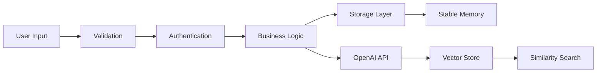

# OpenMemory Development Guide

このドキュメントは、OpenMemoryの開発者向けガイドです。

## 📁 プロジェクト構造

```
OpenMemory/
├── src/                    # Rust Canisterソースコード
│   ├── lib.rs             # エントリーポイント
│   ├── types.rs           # データ構造とCandid型定義
│   ├── errors.rs          # エラーハンドリング
│   ├── validation.rs      # 入力検証とサニタイゼーション
│   ├── auth.rs            # 認証システム
│   ├── storage.rs         # 永続化ストレージ
│   ├── http_handlers.rs   # HTTPリクエストハンドラー
│   ├── embedding.rs       # OpenAI埋め込み生成
│   ├── vector_store.rs    # ベクトル類似検索
│   ├── search.rs          # セマンティック検索
│   ├── suggestions.rs     # 検索提案エンジン
│   ├── clustering.rs      # メモリクラスタリング
│   ├── internet_identity.rs # II統合
│   └── utils.rs           # ユーティリティ関数
├── OpenMemoryUI/          # React フロントエンド
│   ├── src/
│   │   ├── components/    # UIコンポーネント
│   │   ├── pages/         # ページコンポーネント
│   │   ├── services/      # API通信
│   │   └── stores/        # 状態管理
│   └── package.json
├── openmemory-cli/        # Rust CLIツール
│   ├── src/
│   │   ├── main.rs        # CLIエントリーポイント
│   │   ├── config.rs      # 設定管理
│   │   ├── api_client.rs  # API通信
│   │   └── local_identity.rs # ローカル認証
│   └── Cargo.toml
├── dfx.json              # ICP設定
├── Cargo.toml            # Rustプロジェクト設定
└── README.md             # メイン ドキュメント
```

## 🛠️ 開発環境セットアップ

### 前提条件
- Rust 1.70+
- Node.js 18+
- dfx 0.27.0+

### セットアップ手順
```bash
# 1. dfx のインストール
sh -ci "$(curl -fsSL https://smartcontracts.org/install.sh)"

# 2. 依存関係のインストール
npm install -g @dfinity/didc

# 3. ローカルレプリカを起動
dfx start --background

# 4. 初回ビルド・デプロイ
dfx build
dfx deploy
```

## 🏗️ アーキテクチャ詳細

### 認証フロー


```mermaid
sequenceDiagram
    participant User
    participant Frontend
    participant CLI
    participant Canister
    participant II as Internet Identity
    
    # Web UI フロー
    User->>Frontend: Login
    Frontend->>II: Authenticate
    II-->>Frontend: Identity
    Frontend->>Canister: Authenticated Request
    
    # CLI フロー (ãƒã‚¤ãƒ–リッドトークン)
    User->>Frontend: Generate Token
    Frontend->>Canister: Create Token (II Auth)
    Canister-->>Frontend: Access Token
    User->>CLI: Use Token
    CLI->>Canister: API Request (Token Auth)
```

### データフロー


## 📝 コーディング規約

### Rust コード
```rust
// ✅ Good: 構造化エラーハンドリング
pub fn save_memory(memory: Memory) -> Result<String> {
    validate_memory(&memory)?;
    let id = storage::save_memory(memory)
        .map_err(|e| OpenMemoryError::storage(e, "save_memory"))?;
    Ok(id)
}

// ❌ Bad: String エラー
pub fn save_memory(memory: Memory) -> Result<String, String> {
    // ...
}
```

### TypeScript コード
```typescript
// ✅ Good: 型安全性
interface MemoryData {
  id: string;
  content: string;
  tags: string[];
  createdAt: number;
}

// ❌ Bad: any型
const memory: any = response.data;
```

### エラーハンドリング
```rust
// ✅ Good: 詳細なエラー情報
return Err(OpenMemoryError::validation(
    "Content too large",
    Some("content")
));

// ❌ Bad: 汎用エラー
return Err("Error".to_string());
```

## 🧪 テスト戦略

### Unit Tests
```rust
#[cfg(test)]
mod tests {
    use super::*;
    
    #[test]
    fn test_validate_memory() {
        let memory = Memory {
            content: "Valid content".to_string(),
            // ...
        };
        assert!(validate_add_memory_request(&memory).is_ok());
    }
}
```

### Integration Tests
```bash
# Canister関数の直接テスト
dfx canister call openmemory add_memory '(record { content = "test"; tags = vec {}; metadata = record {} })'

# HTTP エンドポイントテスト
curl -X POST "http://localhost:4943/memories" \
  -H "Content-Type: application/json" \
  -d '{"content":"test"}'
```

## 🚀 デプロイメント

### ローカル環境
```bash
# ビルド
dfx build

# デプロイ
dfx deploy

# 関数テスト
dfx canister call openmemory http_request '(record { 
  url = "/health"; 
  method = "GET"; 
  body = vec {}; 
  headers = vec {} 
})'
```

### 本番環境
```bash
# メインネットにデプロイ
dfx deploy --network ic

# CanisterIDを確認
dfx canister id openmemory --network ic
```

## 🔧 トラブルシューティング

### よくある問題

#### 1. Canisterのビルドエラー
```bash
# Rust環境をクリーン
cargo clean
dfx build --check
```

#### 2. メモリ不足エラー
```rust
// StableBTreeMapのメモリ使用量を確認
ic_cdk::println!("Memory usage: {} pages", ic_cdk::api::stable::stable_size());
```

#### 3. HTTP Outcall エラー
```rust
// OpenAI APIキーの設定を確認
match get_user_config(user_id) {
    Ok(Some(config)) => {
        ic_cdk::println!("API provider: {:?}", config.api_provider);
    }
    _ => ic_cdk::println!("No API config found"),
}
```

### デバッグ

#### ログ出力
```rust
// デバッグ情報の出力
ic_cdk::println!("Processing request: {}", request_id);
ic_cdk::println!("User: {}, Operation: {}", user_id, operation);
```

#### レプリカログ確認
```bash
# ローカルレプリカのログ
dfx start --background
tail -f .dfx/local/replica.log
```

## 📊 パフォーマンス最適化

### メモリ使用量
```rust
// Candid型のメモリ効率化
#[derive(CandidType, Deserialize)]
pub struct CompactMemory {
    #[serde(skip_serializing_if = "Option::is_none")]
    pub embedding: Option<Vec<f32>>,
}
```

### ベクトル検索
```rust
// 事前計算されたノルムの使用
pub fn optimized_cosine_similarity(a: &[f32], b: &[f32], norm_a: f32, norm_b: f32) -> f32 {
    let dot_product: f32 = a.iter().zip(b.iter()).map(|(x, y)| x * y).sum();
    dot_product / (norm_a * norm_b)
}
```

## 🔐 セキュリティ

### 入力検証
```rust
// 全ての入力を検証
pub fn add_memory(req: AddMemoryRequest, user: Principal) -> Result<String> {
    validate_add_memory_request(&req)?;
    validate_user_quota(user, get_user_memory_count(user)?)?;
    // ...
}
```

### 認証
```rust
// Principal ベースのアクセス制御
fn check_memory_access(memory_id: &str, user: Principal) -> Result<()> {
    let memory = get_memory(memory_id)?;
    if memory.user_id != user {
        return Err(OpenMemoryError::authentication(
            "Access denied", 
            "memory_access"
        ));
    }
    Ok(())
}
```

## 📈 監視とメトリクス

### 基本メトリクス
```rust
// システム統計の収集
pub fn get_system_stats() -> SystemStats {
    SystemStats {
        total_memories: get_memory_count(),
        total_users: get_user_count(),
        uptime: get_uptime_seconds(),
    }
}
```

### エラー追跡
```rust
// エラーカテゴリ別の集計
match &error {
    OpenMemoryError::OpenAI { .. } => increment_counter("errors.openai"),
    OpenMemoryError::Storage { .. } => increment_counter("errors.storage"),
    _ => increment_counter("errors.other"),
}
```

## 🤝 コントリビューション

### Pull Request プロセス
1. フォークとブランチ作成
2. 変更とテスト追加
3. `cargo test` でテスト実行
4. `dfx deploy` でローカルテスト
5. PR作成

### コードレビュー チェックリスト
- [ ] エラーハンドリングが適切
- [ ] 入力検証が実装済み
- [ ] テストが追加済み
- [ ] ドキュメントが更新済み
- [ ] セキュリティ考慮済み

## 📚 参考資料

- [IC SDK Documentation](https://internetcomputer.org/docs)
- [Candid Reference](https://internetcomputer.org/docs/current/references/candid-ref)
- [IC Rust CDK](https://docs.rs/ic-cdk/latest/ic_cdk/)
- [Stable Structures](https://docs.rs/ic-stable-structures/latest/ic_stable_structures/)