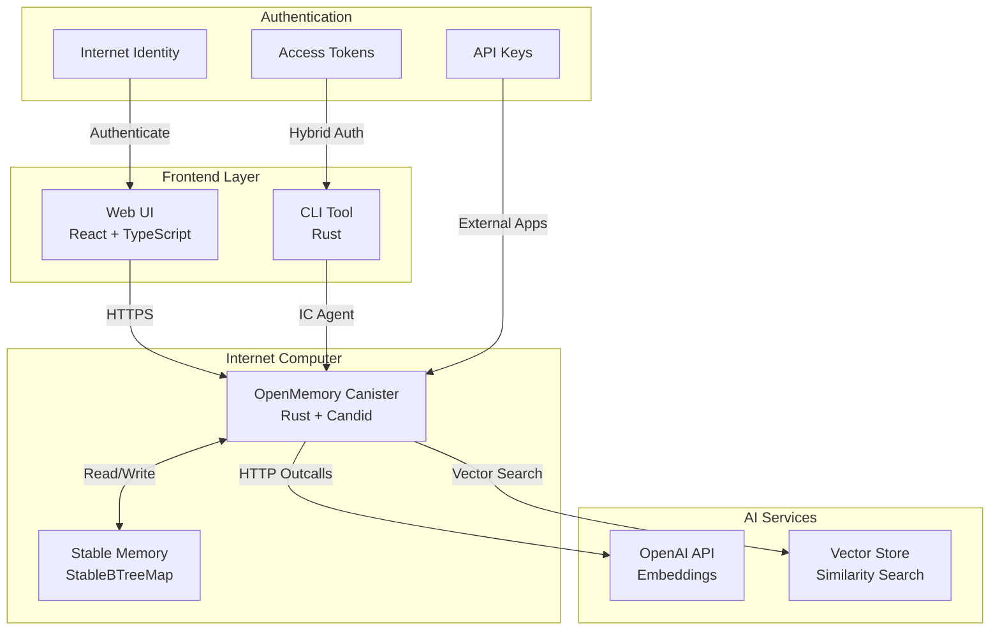

# OpenMemory - AI-Powered Personal Memory System on ICP

> 🧠 **Personal AI Memory System** - Internet Computer Protocol上で動作する、セマンティック検索とAI分析を備えた次世代パーソナルメモリシステム

[](https://77fv5-oiaaa-aaaal-qsoea-cai.icp0.io)
[](https://7yetj-dqaaa-aaaal-qsoeq-cai.icp0.io)
[](./openmemory-cli/)
[](LICENSE)

## 🌟 概要

OpenMemoryは、Internet Computer Protocol（ICP）上に構築された革新的なAI駆動メモリ管理システムです。個人の知識を効率的に保存・整理・検索し、AIによる意味理解でコンテキストに基づいた情報の発見を可能にします。

### ✨ 主な特徴

- 🔍 **セマンティック検索** - OpenAI埋め込みベクトルによる意味理解検索
- 🧩 **自動クラスタリング** - 関連するメモリの自動分類・整理
- 🔐 **分散認証** - Internet Identityとハイブリッドトークン認証
- 💻 **CLI & Frontend** - ウェブUI + 専用CLIツール
- 🌐 **外部連携** - REST API + Claude Code統合
- 📝 **会話管理** - IDEとの統合による開発履歴保存

### 🏗️ アーキテクチャ



## 🚀 クイックスタート

### 1. ウェブUIを試す
```bash
# ブラウザで以下にアクセス
https://7yetj-dqaaa-aaaal-qsoeq-cai.icp0.io
```

### 2. CLIツールをインストール
```bash
cd openmemory-cli
cargo install --path .
openmemory init
```

### 3. APIを使用
```bash
curl -X POST "https://77fv5-oiaaa-aaaal-qsoea-cai.raw.icp0.io/memories" \
  -H "Content-Type: application/json" \
  -H "X-API-Key: openmemory-api-key-development" \
  -d '{"content":"AIメモリシステムのテスト"}'
```

## 📚 ドキュメント目次

- [インストールとセットアップ](#インストールとセットアップ)
- [認証システム](#認証システム)
- [API リファレンス](#api-リファレンス)
- [CLI使用方法](#cli使用方法)
- [開発者ガイド](#開発者ガイド)
- [統合例](#統合例)

## 🛠️ インストールとセットアップ

### システム要件
- **Rust**: 1.70+ (Canister開発用)
- **Node.js**: 18+ (Frontend開発用)  
- **dfx**: 0.27.0+ (ICP開発用)

### ローカル開発環境
```bash
# 1. リポジトリをクローン
git clone <repository-url>
cd OpenMemory

# 2. ICPローカルネットワークを起動
dfx start --background

# 3. Canisterをビルド・デプロイ
dfx build
dfx deploy

# 4. フロントエンドを起動
cd OpenMemoryUI
npm install
npm run dev

# 5. CLIツールをビルド
cd ../openmemory-cli
cargo build --release
```

### 本番環境接続
- **Canister**: `https://77fv5-oiaaa-aaaal-qsoea-cai.raw.icp0.io`
- **Frontend**: `https://7yetj-dqaaa-aaaal-qsoeq-cai.icp0.io`

## 🔐 認証システム

OpenMemoryは3つの認証方式をサポートしています：

### 1. Internet Identity（推奨・フロントエンド）
```typescript
// ウェブUIでの使用
import { AuthClient } from "@dfinity/auth-client";

const authClient = await AuthClient.create();
await authClient.login({
  identityProvider: "https://identity.ic0.app"
});
```

### 2. ハイブリッドトークン認証（CLI連携）
```bash
# 1. フロントエンドでII認証してトークン生成
# 2. CLIでトークン使用
openmemory token use om_token_abc123...
openmemory add "フロントエンドと同期されるメモリ"
```

### 3. API Key認証（外部統合）
```bash
curl -X POST "${BASE_URL}/memories" \
  -H "Content-Type: application/json" \
  -H "X-API-Key: openmemory-api-key-development" \
  -d '{"content":"テストメモリ"}'
```

### 認証方式比較

| 方式 | 使用場面 | セキュリティ | データ共有 |
|------|---------|-------------|----------|
| Internet Identity | Webアプリ | 最高 | ✅ |
| ハイブリッドトークン | CLI↔Web連携 | 高 | ✅ |
| API Key | 外部統合・開発 | 中 | ❌ |

## 💻 CLI使用方法

詳細は[CLI README](./openmemory-cli/README.md)を参照してください。

### 基本的な使用方法
```bash
# 初期設定
openmemory init

# メモリ追加
openmemory add "今日学んだRustのthread_localパターンについて" --tags "rust,programming"

# セマンティック検索
openmemory search "Rustの並行処理"

# トークン管理（フロントエンド連携）
openmemory token create --description "MacBook CLI" --expires-in-days 30
openmemory token use om_token_abc123...

# 設定確認
openmemory whoami
```

## 📡 API リファレンス

### エンドポイント一覧

| Method | Endpoint | 説明 | 認証 |
|--------|----------|------|------|
| POST | `/memories` | メモリ追加 | 必須 |
| GET | `/memories` | メモリ一覧 | 必須 |
| GET | `/memories/{id}` | 特定メモリ取得 | 必須 |
| DELETE | `/memories/{id}` | メモリ削除 | 必須 |
| POST | `/memories/search` | セマンティック検索 | 必須 |
| POST | `/conversations` | 会話保存 | 必須 |
| GET | `/conversations` | 会話一覧 | 必須 |
| POST | `/auth/tokens` | トークン作成 | II必須 |
| GET | `/auth/tokens` | トークン一覧 | 必須 |
| DELETE | `/auth/tokens/{token}` | トークン無効化 | 必須 |
| GET | `/clusters` | クラスター一覧 | 任意 |
| GET | `/health` | ヘルスチェック | 不要 |

## 📝 メモリ管理

### メモリを追加
```bash
POST /memories
```

**リクエスト例:**
```json
{
  "content": "今日学んだReactのuseEffectフックについて",
  "tags": ["react", "javascript", "programming"],
  "metadata": {
    "category": "learning",
    "source": "tutorial"
  }
}
```

**レスポンス例:**
```json
{
  "id": "mem_123abc",
  "created_at": 1748833231773490066
}
```

### メモリ一覧を取得
```bash
GET /memories?limit=50&offset=0
```

**レスポンス例:**
```json
{
  "memories": [
    {
      "id": "mem_123abc",
      "user_id": "user_xyz",
      "content": "今日学んだReactのuseEffectフック",
      "embedding": [...],
      "metadata": {"category": "learning"},
      "tags": ["react", "javascript"],
      "created_at": 1748833231773490066,
      "updated_at": 1748833231773490066
    }
  ],
  "limit": 50,
  "offset": 0,
  "total_count": 100
}
```

### 特定のメモリを取得
```bash
GET /memories/{memory_id}
```

### メモリを削除
```bash
DELETE /memories/{memory_id}
```

## 💬 会話履歴管理

OpenMemory APIは、Claude CodeなどのIDEとの統合を想定した会話履歴管理機能を提供します。

### 会話を保存
```bash
POST /conversations
```

**リクエスト例:**
```json
{
  "title": "Reactコンポーネントの最適化について",
  "content": "User: Reactコンポーネントのパフォーマンスを最適化する方法を教えて\n\nAssistant: Reactコンポーネントの最適化には以下の方法があります...",
  "source": "claude_code",
  "metadata": {
    "project": "my-react-app",
    "file_path": "src/components/MyComponent.tsx",
    "language": "typescript"
  }
}
```

**レスポンス例:**
```json
{
  "id": "conv_456def",
  "title": "Reactコンポーネントの最適化について",
  "word_count": 450,
  "created_at": 1748833231773490066,
  "message": "Conversation saved successfully"
}
```

### 会話履歴一覧を取得
```bash
GET /conversations?limit=20&offset=0
```

**レスポンス例:**
```json
{
  "conversations": [
    {
      "id": "conv_456def",
      "user_id": "user_xyz",
      "title": "Reactコンポーネントの最適化について",
      "content": "User: ...\nAssistant: ...",
      "source": "claude_code",
      "metadata": {"project": "my-react-app"},
      "word_count": 450,
      "created_at": 1748833231773490066,
      "updated_at": 1748833231773490066
    }
  ],
  "limit": 20,
  "offset": 0,
  "total_count": 15
}
```

## 🔍 検索機能

### セマンティック検索
```bash
POST /memories/search
```

**リクエスト例:**
```json
{
  "query": "React hooks",
  "limit": 10,
  "tags": ["react", "javascript"]
}
```

**レスポンス例:**
```json
{
  "results": [
    {
      "memory": {
        "id": "mem_123abc",
        "content": "Reactのカスタムフックの作り方...",
        "tags": ["react", "hooks"]
      },
      "similarity_score": 0.85
    }
  ],
  "total_count": 5,
  "query_time_ms": 120
}
```

## 🧩 クラスタリング

### クラスター一覧を取得
```bash
GET /clusters?min_cluster_size=2
```

### 新しいクラスターを作成
```bash
POST /clusters
```

**リクエスト例:**
```json
{
  "memory_ids": ["mem_123", "mem_456", "mem_789"],
  "method": "content",
  "name": "React学習メモ",
  "description": "Reactに関する学習内容をまとめたクラスター"
}
```

## 🛠 SDK の使用

### JavaScript/TypeScript
```typescript
import axios from 'axios';

class OpenMemoryClient {
  private baseURL = 'https://77fv5-oiaaa-aaaal-qsoea-cai.raw.icp0.io';
  private apiKey: string;

  constructor(apiKey: string) {
    this.apiKey = apiKey;
  }

  private getHeaders() {
    return {
      'Content-Type': 'application/json',
      'X-API-Key': this.apiKey
    };
  }

  async addMemory(content: string, tags?: string[]) {
    const response = await axios.post(`${this.baseURL}/memories`, {
      content,
      tags: tags || []
    }, {
      headers: this.getHeaders()
    });
    return response.data;
  }

  async saveConversation(title: string, content: string, source = 'api') {
    const response = await axios.post(`${this.baseURL}/conversations`, {
      title,
      content,
      source
    }, {
      headers: this.getHeaders()
    });
    return response.data;
  }

  async searchMemories(query: string, limit = 10) {
    const response = await axios.post(`${this.baseURL}/memories/search`, {
      query,
      limit
    }, {
      headers: this.getHeaders()
    });
    return response.data;
  }
}

// 使用例
const client = new OpenMemoryClient('your_api_key_here');

// メモリを追加
await client.addMemory('今日学んだこと', ['learning', 'notes']);

// 会話を保存
await client.saveConversation(
  'プログラミング相談',
  'User: エラーが出ます\nAssistant: そのエラーの詳細を...',
  'claude_code'
);

// 検索
const results = await client.searchMemories('React hooks');
```

### Python
```python
import requests
import json

class OpenMemoryClient:
    def __init__(self, api_key: str):
        self.base_url = "https://77fv5-oiaaa-aaaal-qsoea-cai.raw.icp0.io"
        self.api_key = api_key
        self.headers = {
            "Content-Type": "application/json",
            "X-API-Key": api_key
        }
    
    def add_memory(self, content: str, tags: list = None):
        """メモリを追加"""
        data = {
            "content": content,
            "tags": tags or []
        }
        response = requests.post(
            f"{self.base_url}/memories",
            headers=self.headers,
            json=data
        )
        return response.json()
    
    def save_conversation(self, title: str, content: str, source: str = "api"):
        """会話を保存"""
        data = {
            "title": title,
            "content": content,
            "source": source
        }
        response = requests.post(
            f"{self.base_url}/conversations",
            headers=self.headers,
            json=data
        )
        return response.json()
    
    def search_memories(self, query: str, limit: int = 10):
        """メモリを検索"""
        data = {
            "query": query,
            "limit": limit
        }
        response = requests.post(
            f"{self.base_url}/memories/search",
            headers=self.headers,
            json=data
        )
        return response.json()

# 使用例
client = OpenMemoryClient("your_api_key_here")

# メモリを追加
result = client.add_memory("今日学んだPython", ["python", "programming"])
print(f"メモリID: {result['id']}")

# 会話を保存
conversation = client.save_conversation(
    "Pythonの質問",
    "User: リスト内包表記について教えて\nAssistant: リスト内包表記は...",
    "code_assistant"
)
print(f"会話ID: {conversation['id']}")

# 検索
results = client.search_memories("Python リスト")
for result in results["results"]:
    print(f"類似度: {result['similarity_score']:.2f}")
    print(f"内容: {result['memory']['content'][:50]}...")
```

### curl コマンド例
```bash
#!/bin/bash

API_KEY="your_api_key_here"
BASE_URL="https://77fv5-oiaaa-aaaal-qsoea-cai.raw.icp0.io"

# メモリを追加
add_memory() {
    curl -X POST "${BASE_URL}/memories" \
        -H "Content-Type: application/json" \
        -H "X-API-Key: ${API_KEY}" \
        -d '{
            "content": "今日学んだTypeScript",
            "tags": ["typescript", "programming"]
        }'
}

# 会話を保存
save_conversation() {
    curl -X POST "${BASE_URL}/conversations" \
        -H "Content-Type: application/json" \
        -H "X-API-Key: ${API_KEY}" \
        -d '{
            "title": "TypeScript相談",
            "content": "User: 型定義について教えて\nAssistant: TypeScriptの型定義は...",
            "source": "cli_tool"
        }'
}

# メモリを検索
search_memories() {
    curl -X POST "${BASE_URL}/memories/search" \
        -H "Content-Type: application/json" \
        -H "X-API-Key: ${API_KEY}" \
        -d '{
            "query": "TypeScript 型",
            "limit": 5
        }'
}

# 実行
add_memory
save_conversation
search_memories
```

## ⚠️ エラーハンドリング

### エラーレスポンス形式
```json
{
  "error": "エラーメッセージ",
  "code": 400
}
```

### 一般的なエラーコード
- `400` - Bad Request: リクエストが不正
- `401` - Unauthorized: 認証失敗
- `404` - Not Found: リソースが見つからない
- `429` - Too Many Requests: レート制限超過
- `500` - Internal Server Error: サーバーエラー

### エラーハンドリング例
```typescript
try {
  const result = await client.addMemory(content);
  console.log('Success:', result);
} catch (error) {
  if (error.response?.status === 401) {
    console.error('認証エラー: APIキーを確認してください');
  } else if (error.response?.status === 429) {
    console.error('レート制限: しばらく待ってから再試行してください');
  } else {
    console.error('エラー:', error.response?.data?.error || error.message);
  }
}
```

## 📊 レート制限

現在のレート制限:
- **一般API**: 1分間に60リクエスト
- **検索API**: 1分間に30リクエスト
- **会話保存**: 1分間に20リクエスト

レート制限に達した場合は、`429 Too Many Requests`が返されます。

## 🔗 統合例

### Claude Code統合
```typescript
// Claude Codeプラグイン例
async function saveConversationToOpenMemory(conversation: any) {
  const client = new OpenMemoryClient(process.env.OPENMEMORY_API_KEY);
  
  try {
    const result = await client.saveConversation(
      `Conversation: ${conversation.title}`,
      conversation.messages.map(msg => 
        `${msg.role}: ${msg.content}`
      ).join('\n\n'),
      'claude_code'
    );
    
    console.log('Conversation saved to OpenMemory:', result.id);
    return result;
  } catch (error) {
    console.error('Failed to save conversation:', error);
    throw error;
  }
}
```

### VS Code拡張機能
```typescript
// VS Code拡張機能での使用例
import * as vscode from 'vscode';

async function saveCodeSnippetAsMemory(code: string, language: string) {
  const apiKey = vscode.workspace.getConfiguration('openmemory').get('apiKey');
  const client = new OpenMemoryClient(apiKey);
  
  const activeEditor = vscode.window.activeTextEditor;
  const fileName = activeEditor?.document.fileName || 'unknown';
  
  await client.addMemory(code, [language, 'code_snippet'], {
    file_path: fileName,
    language: language,
    source: 'vscode'
  });
  
  vscode.window.showInformationMessage('Code snippet saved to OpenMemory!');
}
```

## 📱 フロントエンド設定

### API設定画面
OpenMemoryのWebUIから、APIキーの管理と設定を行えます：

1. **サイドバー**から「API Settings」をクリック
2. **新しいAPIキーを作成**ボタンからキーを生成
3. **ベースURL**をカスタムデプロイメント用に変更可能
4. **生成されたキー**をコピーして外部アプリケーションで使用

### 設定手順
1. `https://7yetj-dqaaa-aaaal-qsoeq-cai.icp0.io`にアクセス
2. Internet Identityでログイン
3. サイドバーの「API Settings」をクリック
4. 「新しいキーを作成」で任意の名前を入力
5. 生成されたAPIキーをコピー
6. 外部アプリケーションで使用

## 🤝 サポート

### ドキュメント
- [ICP公式ドキュメント](https://internetcomputer.org/docs)
- [Candid Interface](https://a4gq6-oaaaa-aaaab-qaa4q-cai.raw.icp0.io/?id=77fv5-oiaaa-aaaal-qsoea-cai)

### 開発者向けリソース
- **GitHub**: OpenMemoryリポジトリ
- **Discord**: ICP開発者コミュニティ
- **Issue報告**: GitHubのIssuesページ

### Claude Code統合
Claude CodeでOpenMemoryを使用する場合の具体的な統合方法：

1. **MCP Server設定**で`openmemory-mcp`を追加
2. **APIキー**を環境変数に設定
3. **会話履歴の自動保存**を有効化
4. **検索機能**でプロジェクト関連の記憶を参照

---

**注意**: このAPIは現在開発中のため、仕様が変更される可能性があります。本番環境での使用前に最新のドキュメントを確認してください。